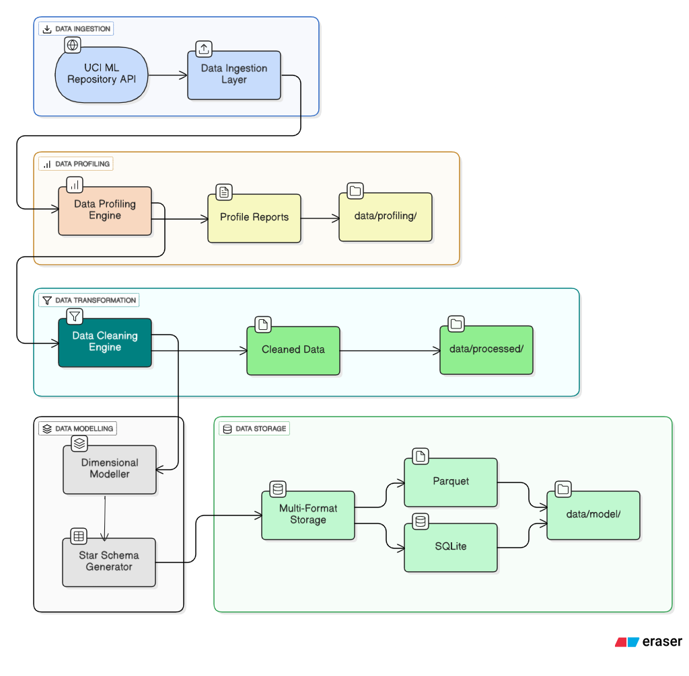
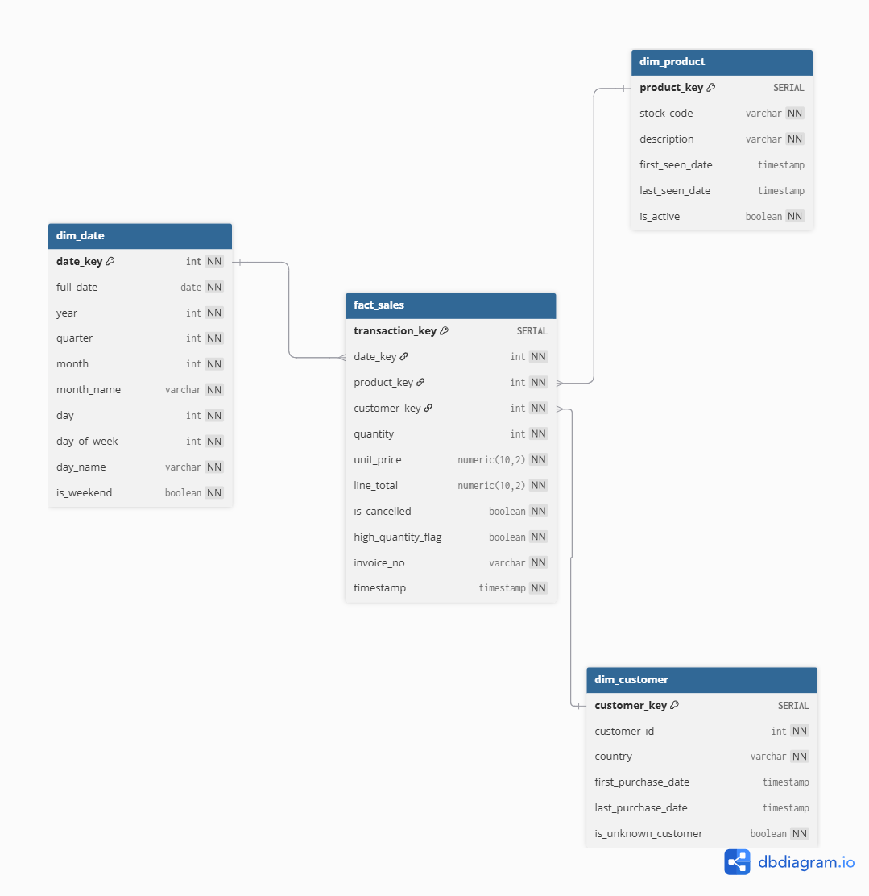

# Online Retail Data Pipeline

## Overview
This project implements an end-to-end ETL pipeline for processing online retail transaction data. The pipeline extracts data from the UCI Machine Learning Repository, applies comprehensive data quality rules, and loads it into a dimensional model optimized for analytical queries.

**Author**: Bernadine Pierre 
**Date**: November 4, 2025  
**Technology Stack**: Python, Pandas, SQL, Parquet

---

## Business Context

The pipeline processes transaction data for a UK-based online retailer specialising in unique all-occasion gifts. The company serves both retail and wholesale customers, with transactions spanning December 2010 to December 2011.

---

## Architecture

### Pipeline Flow
```
UCI ML Repository → Data Ingestion → Data Profiling → Data Cleaning → Dimensional Modeling → Multi-Format Storage
        ↓                  ↓               ↓               ↓                  ↓
    Raw CSV Files    Quality Reports   Cleaned Data   Star Schema      SQLite + Parquet
```

### System Architecture



### Components

1. **Data Ingestion** (`data_ingestion.py`) - Automated data fetching from UCI repository
2. **Data Profiling** (`data_profiling.py`) - Comprehensive data quality assessment
3. **Data Cleaning** (`data_cleaning.py`) - Transformation and validation logic
4. **Data Modelling** (`data_modelling.py`) - Star schema generation
5. **Main Pipeline** (`main_pipeline.py`) - End-to-end orchestration

---

## Data Ingestion

### Automated Fetch from UCI Repository 

The pipeline automatically fetches the latest dataset from the UCI Machine Learning Repository:
```python
python src/main_pipeline.py
```

This will:
1. Fetch data directly from UCI (dataset ID: 352)
2. Save a local backup to `data/raw/Online_Retail_raw_YYYYMMDD_HHMMSS.csv`
3. Process through the complete ETL pipeline
4. Generate comprehensive data quality reports

---

## Data Model

### Data Model Schema



### Star Schema Design

**Fact Table**: `fact_sales`
- Grain: One row per transaction line item
- Measures: quantity, unit_price, line_total
- 534,129 records in typical run

**Dimension Tables**:
- `dim_date`: 374 days (Dec 2010 - Dec 2011) with pre-calculated time attributes
- `dim_product`: 3,938 unique products with descriptions
- `dim_customer`: 4,372 customers (including unknown customers)

### Design Rationale
- **Star schema** chosen for query performance and simplicity
- **Surrogate keys** enable slowly changing dimensions in future
- **Date dimension** pre-calculates time attributes for efficiency
- **Unknown customer handling** (ID=0) preserves revenue from B2B orders
- **Multi-format storage** (SQLite + Parquet) supports different use cases 

---

## Data Quality Framework

### Comprehensive Profiling

The pipeline includes automated data profiling that generates:

- Text reports with detailed quality metrics in `data/profiling/reports/`
- Historical tracking in `data/profiling/profiling_history.csv`
- Business constraint validation with actionable insights

### Quality Metrics (on a typical run)
- **Initial Data Volume**: 541,909 transactions
- **Final Clean Data**: 534,129 transactions
- **Data Quality Pass Rate**: 98.56%
- **Duplicates Removed**: 5,268 (0.97%)
- **Invalid Records Excluded**: 2,512 (0.46%)

### Automated Qulaity Checks

- Data Completeness: Overall 96.85% completeness score
- Business Rule Validation: 6 constraints automatically applied
- Referential Integrity: All dimension keys validated
- Value Reasonability: Quantities and prices within expected ranges

### Data Quality Rules

**Transformation Rules**:
- Missing CustomerIDs → Assigned ID=0 (represents unknown/B2B customers)
- Missing Descriptions → "Unknown Product" placeholder
- Negative Prices → Excluded (assumed data quality errors)
- Duplicates → Removed (first occurrence kept)
- Cancellations → Flagged with `is_cancelled` boolean
- Extreme Quantities → Flagged for business review

**Validation Rules**:
- Prices: Must be positive and flagged if >£10,000
- Quantities: Reasonable ranges for non-cancelled orders
- Foreign Keys: All must reference valid dimension records
- Critical Fields: No nulls in invoice_no, quantity, unit_price

---

## Setup Instructions

### Prerequisites
- Python 3.8+
- pip package manager

### Installation

1. **Clone/Download the project**
```bash
cd online-retail-pipeline
```

2. **Create virtual environment**
```bash
python -m venv venv

# Windows
venv\Scripts\activate

# Mac/Linux
source venv/bin/activate
```

3. **Install dependencies**
```bash
pip install -r requirements.txt
```

4. **Optionl; Manual Download dataset**
- Visit: https://archive.ics.uci.edu/ml/datasets/Online+Retail
- Download `Online Retail.xlsx`
- Place in `data/raw/` directory

### Running the Pipeline

**Full ETL Pipeline**:
```bash
python src/main_pipeline.py
```

**Individual Components**:
```bash
# Data ingestion only
python src/data_ingestion.py

# Data profiling only  
python src/data_profiling.py

# Data cleaning only
python src/data_cleaning.py

# Data modelling only
python src/data_modelling.py
```

### Output Files

The pipeline generates multiple outputs:

- Raw Data: `data/raw/Online_Retail_raw_YYYYMMDD_HHMMSS.csv`
- Cleaned Data: `data/processed/cleaned_data_YYYYMMDD_HHMM.csv`
- Profiling Reports: `data/profiling/reports/profile_report_*.txt`

Dimensional Model:
- SQLite: `data/model/retail_analytics.db`
- Parquet: `data/model/dim_*/` and `data/model/fact_*/`


Logs are saved to `data/logs/pipeline_YYYYMMDD_HHMMSS.log`

---

## Key Findings

### Data Quality Issues Discovered

1. **Missing CustomerIDs (24.9%)**
   - 135,080 records without CustomerID
   - Analysis suggests wholesale orders (B2B)
   - Decision: Retained with surrogate ID=0

2. **Cancellations (1.71%)**
   - 9,288 transactions with invoice prefix 'C'
   - Represents returns and refunds
   - Tracked separately with `is_cancelled` flag

3. **Negative Quantities**
   - 10,624 records with negative quantities
   - Legitimate returns when associated with cancellations
   - Retained for complete business picture

4. **Invalid Prices (0.46%)**
   - 2,512 records with zero/negative prices
   - Assumed to be data quality errors and excluded from analysis

5. **Wholesale Orders**
   - Quantities ranging up to 80,995 units
   - 5 records flagged as high-quantity (>10,000)

---

## Sample Analytical Queries

### Monthly Revenue Trend
```sql
SELECT 
    d.year,
    d.month_name,
    SUM(f.line_total) as revenue,
    COUNT(DISTINCT f.invoice_no) as order_count
FROM fact_sales f
JOIN dim_date d ON f.date_key = d.date_key
WHERE f.is_cancelled = FALSE
GROUP BY d.year, d.month, d.month_name
ORDER BY d.year, d.month;
```

### Top 10 Products by Revenue
```sql
SELECT 
    p.stock_code,
    p.description,
    SUM(f.quantity) as units_sold,
    SUM(f.line_total) as total_revenue
FROM fact_sales f
JOIN dim_product p ON f.product_key = p.product_key
WHERE f.is_cancelled = FALSE
GROUP BY p.stock_code, p.description
ORDER BY total_revenue DESC
LIMIT 10;
```

---

## Development & Exploration

### Development Notebook

For data exploration and development, use the Jupyter notebook:

```bash
jupyter notebook docs/dev_notebook.ipynb
```

This notebook includes:

- Data profiling visualisations
- Pipeline architecture diagrams
- Sample analytical queries
- Data quality assessments

---

## Production Readiness Roadmap

### Implemented
- Data profiling and quality assessment
- Automated ETL pipeline with logging
- Dimensional model (star schema)
- Data validation framework
- Error handling and data type enforcement
- Complete documentation and logging

### Future Enhancements

**Phase 1: Azure Migration**
- Migrate to cloud storage (Azure Blob Storage)
- Implement cloud orchestration (Azure Data Factory)
- Deploy to cloud data warehouse (Azure Synapse)
- Set up pipeline monitoring

**Phase 2: Advanced Features**
- Add incremental loading (process only new/changed records)
- Create aggregate tables for performance
- Build Power BI dashboards connected to the data model

**Phase 3: Data Governance**
- Implement data lineage tracking
- Add data catalog with business glossary
- Create data quality KPI dashboard
- Establish SLA monitoring and alerting

---

## Documentation

### Additional Documentation

Data Dictionary - Comprehensive field definitions and business meanings

Business Transformation Rules - Detailed business logic and validation rules

Development Notebook (docs/dev_notebook.ipynb) - Interactive exploration and analysis

---

## Design Decisions & Trade-offs

### What Worked Well
Star schema simplicity enables fast analytical queries  
High data quality pass rate (98.56%) shows reliable source  
Surrogate keys provide flexibility for future changes  
Automated validation catches issues early  

### Trade-offs Made
**File-based storage**: chosen for simplicity vs database concurrency  
**Unknown customers**: kept records with unknown CustomerIDs vs. excluding 25% of revenue  
**Full refresh approach**: suitable for current dataset size 

### Assumptions
- Data source refreshed daily (batch processing acceptable)
- Historical data is static (no updates to past transactions)
- StockCode is stable as an identifier (no product renames)
- CustomerID=0 represents single "Unknown" segment (not individual customers)

---

## Troubleshooting

### Common Issues

**Issue**: `ModuleNotFoundError`  
**Solution**: Run `pip install -r requirements.txt`

**Issue**: Memory error on large datasets  
**Solution**: Process in chunks or increase available RAM

**Issue**: File permission errors 
**Solution**: Ensure write permissions in `data/` directory structure

---

## Contact & Support

For questions or issues with this pipeline:
- Review logs in `data/logs/`
- Check profiling reports in `data/profiling/reports/`
- Refer to `docs/business_transformation_rules.md` for business logic
- Use `docs/dev_notebook.ipynb` for exploration and debugging

---

## References

- Dataset Source: [UCI Machine Learning Repository](https://archive.ics.uci.edu/ml/datasets/Online+Retail)
- Original Paper: Chen, D., Sain, S.L., Guo, K. (2012). Data mining for the online retail industry: A case study of RFM model-based customer segmentation using data mining. *Journal of Database Marketing & Customer Strategy Management*, 19(3), 197-208.

---

**Last Updated**: Novemeber 4, 2025
